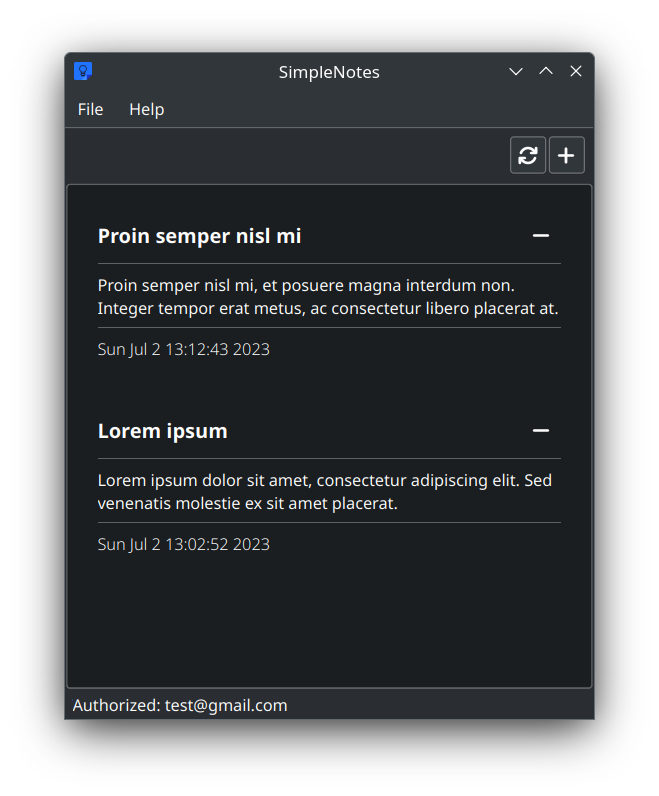
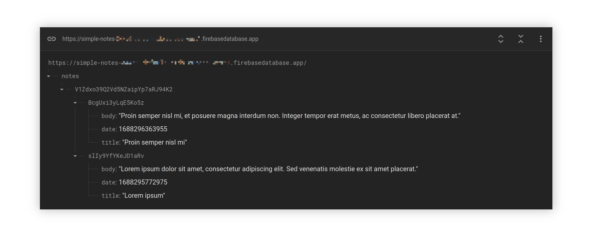

# SimpleNotes


A simple notes app written in C++17.

*Developed within the subject of C++ Programming Language at the AGH University of Science and Technology.*

## Summary

- New note can be created by clicking add ("+") button, by clicking _File => New note_ or via shortcut `Ctrl + N`;
- You can delete your note by clicking remove ("-") button near the note you want to remove;
- In order to synchronize your local notes with remote server, you need:
  1. Click _File => Sign in / up_;
  2. Enter your data (email and password) and click _Sign in_ if you have already created an account or _Sign up_ if you haven't;
  3. Now you can sync your notes: click _File => Synchronize_ or sync button in the toolbar;
  4. Now all your notes are synchronized with the server;
- This app can be used offline (without need to log in), but in that case you won't be able to synchronize your notes.

## Dependencies

1. [Firebase](https://firebase.google.com/) (tested with 11.2.0)
2. [Qt](https://www.qt.io/) 5+ (tested with 5.15.9 and 6.5.1)
3. [QtAwesome](https://github.com/gamecreature/QtAwesome) (included as submodule)

> **Note**
> Clone with submodules using the following command:

```bash
git clone --recurse-submodules https://github.com/congard/simple-notes.git
```

## Configuring

### Firebase

1. In order to build this project you need to [download](https://firebase.google.com/download/cpp) &
   unpack Firebase C++ SDK;
2. You need to [create](https://console.firebase.google.com/) your own instance of
   Firebase Realtime Database and generate your own key:
   1. Add Android app
   2. Download `google-services.json` and place it in SimpleNotes working directory
3. On Linux most likely it will be necessary to install some additional libraries like `libsecret-devel` (Fedora)

### Qt

Qt is used for UI.
<br>Supported versions: Qt5, Qt6.

How to install Qt (Qt6) you can find [here](https://doc.qt.io/qt-6/get-and-install-qt.html)
(it is enough to install just `Desktop gcc 64-bit`).

## Building

CMake options:

| Flag                | Description                               | Required                           |
|---------------------|-------------------------------------------|------------------------------------|
| `FIREBASE_SDK`      | path to unpacked Firebase C++ SDK         | Yes                                |
| `CMAKE_PREFIX_PATH` | path to Qt, e.g. `$HOME/Qt/6.5.1/gcc_64/` | No, if Qt is installed system wide |

```bash
mkdir build
cmake -DCMAKE_BUILD_TYPE=Release -DFIREBASE_SDK="$HOME/firebase_cpp_sdk/" -DCMAKE_PREFIX_PATH="$HOME/Qt/6.5.1/gcc_64/" -Bbuild -G"Unix Makefiles"
cmake --build build --target simple_notes -- -j 4
```

> **Note**
> Do not forget to set valid `FIREBASE_SDK` and `CMAKE_PREFIX_PATH` (if needed) values.

The resulting executable: `build/simple_notes`

> **Note**
> Do not forget to set correct working directory, i.e. directory in which `google-services.json` is located.
> See: [Configuring > Firebase](README.md#firebase) section for details.

> **Warning**
> This project was tested on Linux (Fedora 38) only. 

## Thanks

* Qt developers & community
* Firebase developers
* [Rick Blommers](https://github.com/gamecreature) for [QtAwesome](https://github.com/gamecreature/QtAwesome)
* Google for Google Keep icon :)

## Links

1. [Firebase C++ setup](https://firebase.google.com/docs/cpp/setup?platform=android)
2. [Firebase C++ reference](https://firebase.google.com/docs/reference/cpp)
3. [Qt 6 reference](https://doc.qt.io/qt-6/reference-overview.html)
4. [Qt 6 Widgets docs](https://doc.qt.io/qt-6/qtwidgets-index.html)

## Screenshots



